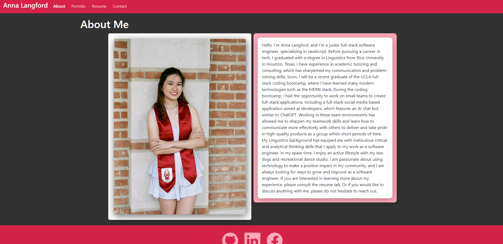

# React Portfolio []

## Description

This [webpage](https://anna-dxj.github.io/react-portfolio) is a professional portfolio for possible employers to look at my experience and previous work. This webpage features an "About Me" section, which provides a brief description of myself as well as a recent photo, a "Portfolio" section which includes my a screenshot, deployed link, repo link, and a brief description of my prevoius projects, a "Resume" section which includes my resume and a downloadable version of it, and finally a "Contact" section, which allows an employer to fill out and contact me. This webpage features a responsive navbar to direct to each section of the webpage and a footer to redirect to my profile links for GitHub, LinkedIn, and Facebook.

On directing themselves to the webpage, potential employers should be routed to the "About Me" section: 

  
Through development of this application, I have gained more comfort using React. This webpage, besides relying on react, also relies on Bootstrap for some icons and to easily handle responsive design and formatting.

  ---
  ## Table of Contents 

  - [Installation](#instlalation)
  - [Usage](#usage)
  - [License](#license) 
  - [Contributing](#contributing)
  - [Tests](#tests)
  ---

## Installation

For commercial use, there are no installation instructions, just redirect to [this link](https://anna-dxj.github.io/react-portfolio). 

For developmental use, one must install dependencies and then start the react server. Please mind the `package.json` to see what other dependencies were used during this project as well as scripts to aid in development. 

  ## Usage 

  To make full use of this application, please direct yourself to [this link](https://anna-dxj.github.io/react-portfolio).

## License
  
[License: MIT](https://opensource.org/licenses/MIT)
  
Copyright 2023 Anna Langford
  
Permission is hereby granted, free of charge, to any person obtaining a copy of this software and associated documentation files (the "Software"), to deal in the Software without restriction, including without limitation the rights to use, copy, modify, merge, publish, distribute, sublicense, and/or sell copies of the Software, and to permit persons to whom the Software is furnished to do so, subject to the following conditions:
  
The above copyright notice and this permission notice shall be included in all copies or substantial portions of the Software.
  
THE SOFTWARE IS PROVIDED "AS IS", WITHOUT WARRANTY OF ANY KIND, EXPRESS OR IMPLIED, INCLUDING BUT NOT LIMITED TO THE WARRANTIES OF MERCHANTABILITY, FITNESS FOR A PARTICULAR PURPOSE AND NONINFRINGEMENT. IN NO EVENT SHALL THE AUTHORS OR COPYRIGHT HOLDERS BE LIABLE FOR ANY CLAIM, DAMAGES OR OTHER LIABILITY, WHETHER IN AN ACTION OF CONTRACT, TORT OR OTHERWISE, ARISING FROM, OUT OF OR IN CONNECTION WITH THE SOFTWARE OR THE USE OR OTHER DEALINGS IN THE SOFTWARE.

## Contributing

No other developers contributed to this application. 

## Tests

This application has no tests.
